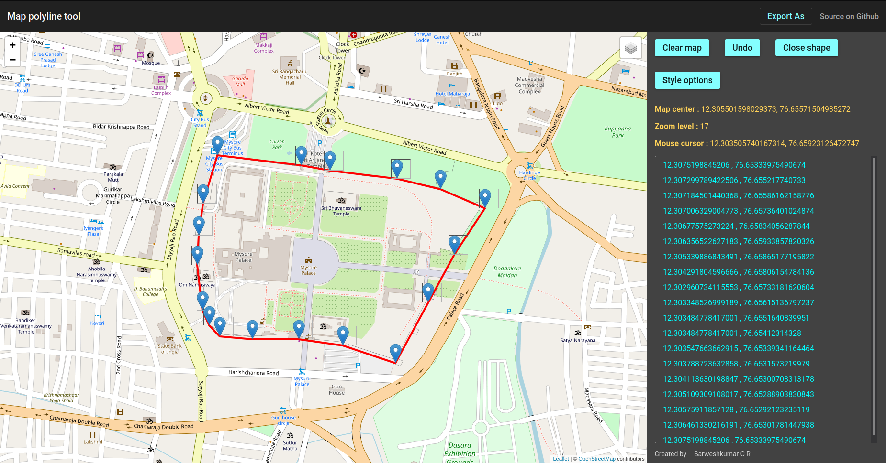

# Map Polyline Tool

This is an angular-based simple map annotation tool that generates a polyline or polygon by simply clicking on the map. Users can extract the lat long points of a 
polyline or polygon, remove your last point, change the style options or clear the whole thing by clicking on relevant buttons. To add a new point
to the map, just left-click on it.

### What is a Polyline?

A Polyline is a series of connected line segments which are useful to represent routes, paths, or other connections between locations on the map.

### What is a Polygon?

A Polygon is a shape consisting of a series of coordinates in an ordered sequence, similar to a Polyline. The difference is that polygon defines a closed area with 
a fillable interior, while a polyline is open-ended.

# Demo

# To-do list

- [ ] Add a feature to export the data as KML
- [ ] Allow user to update the position of a point/marker
- [ ] Add a feature to take screenshots after drawing polyline or polygon on the map
- [ ] Add custom markers support
- [ ] Allow user to hide or show the markers on a map
- [ ] Overlay separate label layer on satellite view

# Credit

### Icons

* 
Icons made by <a href="https://icon54.com/" title="Pixel perfect">Pixel perfect</a> from <a href="https://www.flaticon.com/" title="Flaticon">www.flaticon.com</a>

# License

    MIT License

    Copyright (c) 2021 Sarweshkumar C R

    Permission is hereby granted, free of charge, to any person obtaining a copy
    of this software and associated documentation files (the "Software"), to deal
    in the Software without restriction, including without limitation the rights
    to use, copy, modify, merge, publish, distribute, sublicense, and/or sell
    copies of the Software, and to permit persons to whom the Software is
    furnished to do so, subject to the following conditions:

    The above copyright notice and this permission notice shall be included in all
    copies or substantial portions of the Software.

    THE SOFTWARE IS PROVIDED "AS IS", WITHOUT WARRANTY OF ANY KIND, EXPRESS OR
    IMPLIED, INCLUDING BUT NOT LIMITED TO THE WARRANTIES OF MERCHANTABILITY,
    FITNESS FOR A PARTICULAR PURPOSE AND NONINFRINGEMENT. IN NO EVENT SHALL THE
    AUTHORS OR COPYRIGHT HOLDERS BE LIABLE FOR ANY CLAIM, DAMAGES OR OTHER
    LIABILITY, WHETHER IN AN ACTION OF CONTRACT, TORT OR OTHERWISE, ARISING FROM,
    OUT OF OR IN CONNECTION WITH THE SOFTWARE OR THE USE OR OTHER DEALINGS IN THE
    SOFTWARE.
